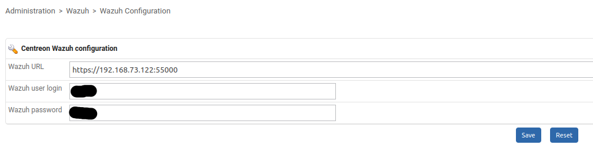
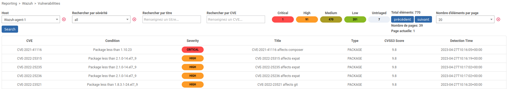
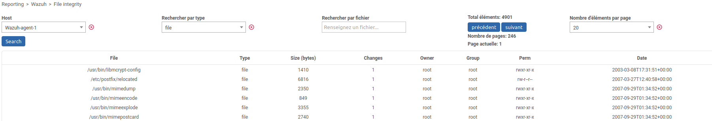
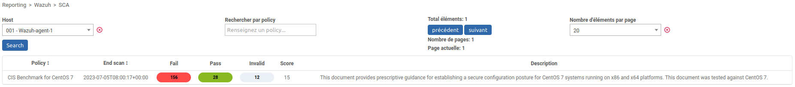
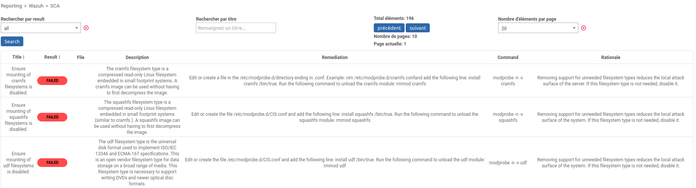

# Centreon module Wazuh

Ce projet contient le code permettant d'exécuter des requêtes vers l'API de Wazuh sur un agent en particulier à partir d'un menu. </br>
Il permet de récupérer les informations de file integrity (syscheck), de vulnérabilités (cve) et de SCA.

## Installation

Pour pouvoir utiliser ce module, connectez vous en SSH à votre serveur Centreon Central puis effectuez ces commandes

```bash
cd /usr/share/centreon/www/modules/
git clone https://github.com/YPSI-SAS/centsoc
```

Puis, allez dans Administration > Extensions > Manager et activez le module "Wazuh Module".</br>

Puis, vous pouvez renseigner les informations de connexion à votre manager wazuh dans le menu Administration > Wazuh > Wazuh Configuration </br>

ATTENTION: L'URL ne doit pas contenir de "/" à la fin !

Puis, vous pouvez consulter les différentes informations dans l'un des menus suivants. Les hôtes proposés sont tous les hôtes ayant une macro WAZUHAGENTID.

## Reporting > Wazuh > Vulnerabilities

Ce menu permet d'avoir accès aux vunérabilités détectées sur un agent wazuh. Pour cela, vous devez sélectionner un hôte et lancer une recherche. </br>
Vous pouvez filtrer par sévérité, par titre ou par CVE. </br>
Vous pouvez trier les données du tableau par ordre de sévérité ou par ordre de CVSS3 Score. </br>
Les CVE sont cliquables pour permettre d'accéder directement à la documentation d'une CVE.


## Reporting > Wazuh > File integrity

Ce menu permet d'avoir accès aux intégrités fichiers détectées sur un agent wazuh. Pour cela, vous devez sélectionner un hôte et lancer une recherche. </br>
Vous pouvez filtrer par type (file ou registry_key/registry_value (windows)) ou par nom de fichier. </br>
Vous pouvez trier les données du tableau par ordre de taille ou par date. </br>


## Reporting > Wazuh > SCA

Ce menu permet d'avoir accès aux policy sur un agent wazuh. Pour cela, vous devez sélectionner un hôte et lancer une recherche. </br>
Vous pouvez filtrer par nom de policy. </br>


Les policy sont cliquables et permettent d'avoir plus d'informations. </br>
Vous pouvez filtrer par titre. </br>
Vous pouvez trier les données du tableau par ordre de result (failed, passed, not applicable). </br>

