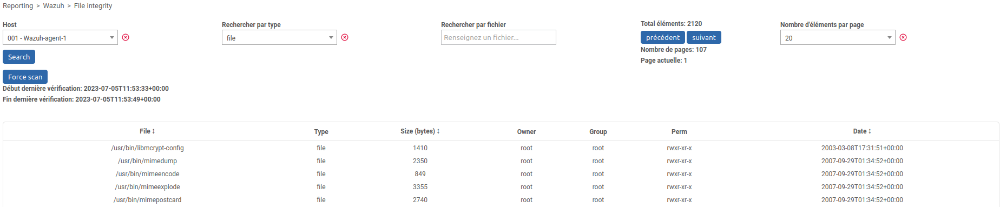

# Centreon module Wazuh

Ce projet contient le code permettant d'exécuter des requêtes vers l'API de Wazuh sur un agent en particulier à partir d'un menu. </br>
Il permet de récupérer les informations de file integrity (syscheck), de vulnérabilités (cve) et de SCA.

## Installation

Pour pouvoir utiliser ce module, connectez vous en SSH à votre serveur Centreon Central puis effectuez ces commandes

```bash
cd /usr/share/centreon/www/modules/
git clone https://github.com/YPSI-SAS/centsoc
```

Puis, allez dans Administration > Extensions > Manager et activez le module "CentSOC".</br>

Puis, vous pouvez renseigner les informations de connexion à votre manager wazuh dans le menu Administration > Wazuh > Wazuh Configuration </br>

ATTENTION: L'URL ne doit pas contenir de "/" à la fin !

Ensuite, ajoutez sur au moins un hôte la macro WAZUHAGENTID avec pour valeur l'ID de l'agent Wazuh installé sur l'hôte correspondant


Vous pouvez lister les ID des agents Wazuh en vous connectant en SSH au Wazuh Manager et en exécutant la commande suivante

```bash
/var/ossec/bin/agent_control -l

#Output:
Wazuh agent_control. List of available agents:
   ID: 000, Name: wazuh-manager (server), IP: 127.0.0.1, Active/Local
   ID: 001, Name: host01, IP: any, Active
   ID: 002, Name: host02, IP: any, Active
   ID: 003, Name: host03, IP: any, Disconnected

```


Puis, vous pouvez consulter les différentes informations dans l'un des menus suivants. Les hôtes proposés sont tous les hôtes ayant une macro WAZUHAGENTID.

## Reporting > Wazuh > Vulnerabilities

Ce menu permet d'avoir accès aux vunérabilités détectées sur un agent wazuh. Pour cela, vous devez sélectionner un hôte et lancer une recherche. </br>
Vous pouvez filtrer par sévérité, par titre ou par CVE. </br>
Vous pouvez trier les données du tableau par ordre de sévérité ou par ordre de CVSS3 Score. </br>
Les CVE sont cliquables pour permettre d'accéder directement à la documentation d'une CVE.


## Reporting > Wazuh > File integrity

Ce menu permet d'avoir accès aux intégrités fichiers détectées sur un agent wazuh. Pour cela, vous devez sélectionner un hôte et lancer une recherche. </br>
Vous pouvez filtrer par type (file ou registry_key/registry_value (windows)) ou par nom de fichier. </br>
Vous pouvez trier les données du tableau par ordre de taille ou par date. </br>


## Reporting > Wazuh > SCA

Ce menu permet d'avoir accès aux policy sur un agent wazuh. Pour cela, vous devez sélectionner un hôte et lancer une recherche. </br>
Vous pouvez filtrer par nom de policy. </br>


Les policy sont cliquables et permettent d'avoir plus d'informations. </br>
Vous pouvez filtrer par titre. </br>
Vous pouvez trier les données du tableau par ordre de result (failed, passed, not applicable). </br>

