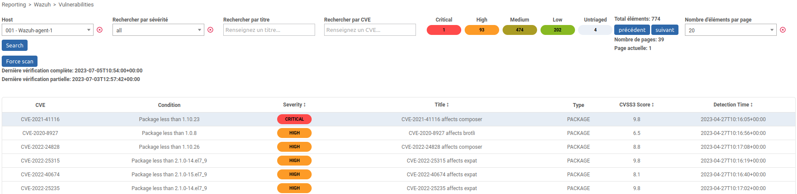

# CentSOC

CentSOC is a module for Centreon to add Wazuh last scans results to the Centreon UI through Wazuh Manager API
With CentSOC, you can see vulnerabilities, SCA and Syscheck scans results


## Prerequisites

To use CentSOC, you needs:
- A Wazuh Manager server
- At least one server with a Wazuh Agent installed
- A Wazuh Manager API Account
- A Centreon Central Server

## Installation

Connect to your Centreon Central server's terminal and use this command</br>

```bash
cd /usr/share/centreon/www/modules/
git clone https://github.com/YPSI-SAS/centsoc
```


Then, connect to your Centreon WebUI in Administration > Extensions > Manager menu and install CentSOC</br>


Go to Administration > Wazuh > Wazuh Configuration and set Wazuh Manager Address and API Credentials</br>


ATTENTION: Wazuh Manager URL must not contain "/" at the end !


Before using CentSOC, you first need to set WAZUHAGENTID macro on at least one host, with the id of the Wazuh agent installed on the corresponding host</br>


You can list Wazuh Agents IDs on the Wazuh Manager with the next command:

```bash
/var/ossec/bin/agent_control -l

#Output:
Wazuh agent_control. List of available agents:
   ID: 000, Name: wazuh-manager (server), IP: 127.0.0.1, Active/Local
   ID: 001, Name: host01, IP: any, Active
   ID: 002, Name: host02, IP: any, Active
   ID: 003, Name: host03, IP: any, Disconnected

```


You now can start to use CentSOC and check what Wazuh Agents's Scan found in the 3 differents views for your hosts with a defined WAZUHAGENTID macro </br>
For each view, you need to select an host and then press the Search button</br>

## Reporting > Wazuh > Vulnerabilities

Vulnerabilities view show all vulnerabilities found by the Wazuh Agent</br>
You can filter the results by severity, title or CVE</br>
You can also sort the results by severity or CVES3 Score</br>
CVE ID's are clickable and redirect to their dedicated page on cve.org


## Reporting > Wazuh > File integrity
File Integrity view show results for syscheck scans on files</br>
You can filter by file name, or by entry type (file or regisrty_key/registry_value)</br>
You can also sort by filesize and by date


## Reporting > Wazuh > SCA

SCA view can list the conformity policies applied on the selected host, and show the results</br>


You can click on Policy name to get the details of the tests done by the agent </br>
You can sort the tests by the results (failed, pass, invalid)

